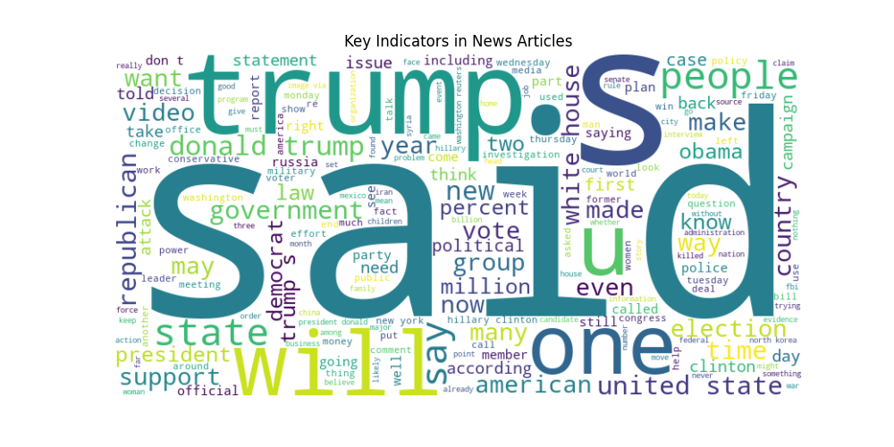
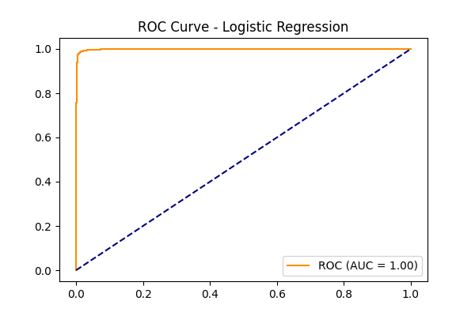
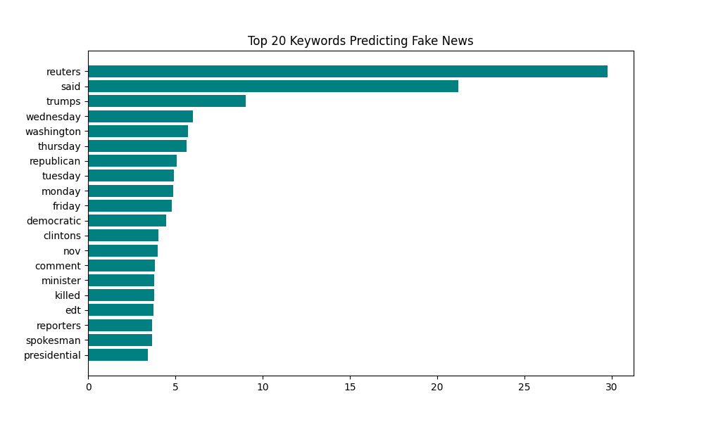

# 🕵️‍♂️ Text-Intelligence: High-Accuracy NLP Misinformation Detection

**Academic Research Project | CIS 593 Special Topics | Cleveland State University**

This repository features a production-grade NLP pipeline designed to classify misinformation across 44,000+ news articles. Unlike standard "black-box" models, this system prioritizes **Explainability**, extracting the specific linguistic drivers that influence AI decision-making in the misinformation domain.

---

## 📜 Project Genesis & Research
This project originated as a formal research proposal for the **CIS 593 Graduate Course** at CSU. I transitioned the theoretical plan into a modular Python architecture, focusing on the trade-offs between model interpretability and predictive performance.

👉 **Full Research Specification:** [Project Proposal Document](./documentation/ProjectProposal.pdf)

---

## 🛠️ Technical Architecture
I implemented a modular design to ensure scalability and prevent common pitfalls like data leakage.

1. **Modular Preprocessing (`nlp_preprocessing_utils.py`):** Custom engine for regex-based noise reduction, case-normalization, and stop-word filtering.
2. **Feature Engineering:** Leveraged **TF-IDF (Term Frequency-Inverse Document Frequency)** to transform raw text into a weighted numerical matrix, penalizing high-frequency neutral terms.
3. **Model Orchestration (`main.py`):**
   - **Baseline:** Multinomial Naive Bayes (Probabilistic approach).
   - **Champion Model:** Logistic Regression (Discriminative approach).
4. **Optimization:** Utilized **GridSearchCV** with 3-fold cross-validation to optimize the regularization strength ('C' parameter), ensuring the model generalizes well to unseen data.

---

## 📊 Visual Insights & Performance Analysis

### 1. Linguistic Patterns (Word Cloud)
Before modeling, I used a word cloud to identify high-cardinality terms. This informed the TF-IDF vectorization strategy by highlighting domain-specific vocabulary.

### 2. Model Robustness (ROC Curve)
The Logistic Regression model demonstrated excellent discriminative capability. The high Area Under the Curve (AUC) indicates a strong balance between catching misinformation (Recall) and protecting legitimate news (Precision).

### 3. Feature Importance (Interpretability)
To ensure **Explainable AI**, I extracted the model's coefficients. This bar chart identifies the top 20 words that most significantly trigger a "Fake News" classification, allowing stakeholders to understand the "why" behind every prediction.

---

## 🚀 Key Engineering Choices
- **Scikit-Learn Pipelines:** Integrated vectorization and classification into a unified object to ensure the test set remained strictly unseen during preprocessing.
- **Dimensionality Management:** Used `min_df` and `max_df` constraints in the TF-IDF stage to reduce noise and optimize computational overhead.
- **Standardized Metrics (`model_evaluation_metrics.py`):** Built a standalone evaluation utility to generate consistent Confusion Matrices and Classification Reports across different model iterations.

---

## 💻 Tech Stack
- **Languages:** Python 3.11
- **ML Frameworks:** Scikit-Learn (Pipelines, GridSearchCV, Linear Models)
- **Data Engineering:** Pandas, NumPy
- **Visualization:** Seaborn, Matplotlib, WordCloud

---
**Author:** Harshini (@Hercodes-ux)  
**Track:** Summer 2026 Associate Data Scientist / Analytics Engineer Candidate
